- [Métodos de ordenación y búsqueda](#métodos-de-ordenación-y-búsqueda)
- [Métodos de ordenación](#métodos-de-ordenación)
  - [Método burbuja](#método-burbuja)
    - [Algoritmo del metodo de ordenación burbuja](#algoritmo-del-metodo-de-ordenación-burbuja)
    - [Eficiencia del método burbuja](#eficiencia-del-método-burbuja)
  - [Método selección](#método-selección)
    - [Algoritmo del metodo de ordenación selección](#algoritmo-del-metodo-de-ordenación-selección)
    - [Eficiencia del método selección](#eficiencia-del-método-selección)
  - [Método inserción](#método-inserción)
    - [Algoritmo del metodo de ordenación inserción](#algoritmo-del-metodo-de-ordenación-inserción)
    - [Eficiencia del método inserción](#eficiencia-del-método-inserción)
  - [Método shell](#método-shell)
    - [Algoritmo del metodo de ordenación shellSort](#algoritmo-del-metodo-de-ordenación-shellsort)
    - [Eficiencia del método shellSort](#eficiencia-del-método-shellsort)
  - [Método quicksort](#método-quicksort)
    - [Algoritmo del metodo de ordenación quicksort](#algoritmo-del-metodo-de-ordenación-quicksort)
    - [Eficiencia del método quickSort](#eficiencia-del-método-quicksort)
  - [Comparación de la eficiencia del los métodos de ordenación](#comparación-de-la-eficiencia-del-los-métodos-de-ordenación)
- [Métodos de búsqueda](#métodos-de-búsqueda)
  - [Método secuencial o lineal](#método-secuencial-o-lineal)
    - [Algoritmo del metodo de búsqueda secuencial](#algoritmo-del-metodo-de-búsqueda-secuencial)
    - [Eficiencia del metodo secuencial o lineal](#eficiencia-del-metodo-secuencial-o-lineal)
  - [Método Binario](#método-binario)
    - [Algoritmo del metodo de búsqueda binaria](#algoritmo-del-metodo-de-búsqueda-binaria)
    - [Eficiencia del método busqueda binaria](#eficiencia-del-método-busqueda-binaria)
      - [Versión iterativa](#versión-iterativa)
      - [Versión recursiva](#versión-recursiva)
  - [Comparación de la eficiencia del los métodos de búsqueda](#comparación-de-la-eficiencia-del-los-métodos-de-búsqueda)

# Métodos de ordenación y búsqueda

En este repositorio veremos diferentes métodos de ordenación y el tiempo que tardan en ordenar o buscar los datos dentro de un array. Su tamaño iniciara con 1.000 sigue con 5.000 en 5.000 hasta 100.000. Para asegurarnos que la prueba es lo más imparcial posible se ordenara el array 3 veces distintas con números aleatorios por cada tamaño del array.

Si quieres podrás revisar el [código](src/main/kotlin/Metodos/) en este repositorio.

# Métodos de ordenación

Los métodos de ordenación nos permite ordenar arrays. Pero ojo, debemos tener en cuenta que dependiendo del método de ordenación así será su eficiencia. Por lo que debemos tener en cuenta el tipo de datos que vamos a ordenar y el tamaño del array.

Puedes visualizarlos [aquí](https://www.cs.usfca.edu/~galles/visualization/Algorithms.html)

## Método burbuja

Es un método de [ordenación](https://es.wikipedia.org/wiki/Ordenamiento_de_burbuja) con eficiencia O(n²). Es decir, el tiempo de ejecución es proporcional al cuadrado del tamaño del array. Este método consiste en ir comparando cada elemento con el siguiente, y si el elemento actual es mayor que el siguiente, se intercambian. Este proceso se repite hasta que no se producen más intercambios. Este método es muy sencillo de implementar, pero no es el más eficiente.

- <https://www.youtube.com/watch?v=lyZQPjUT5B4>

<div align="center"></div>

### Algoritmo del metodo de ordenación burbuja

````Kotlin
fun burbuja(array: IntArray) {
  var aux: Int
  for (i in 0 until array.size) {
    for (j in 0 until array.size - 1) {
      if (array[j] > array[j + 1]) {
        aux = array[j]
        array[j] = array[j + 1]
        array[j + 1] = aux
      }
    }
  }
}
````

### Eficiencia del método burbuja

El método **burbuja** escala de forma exponencial pero más exagerado en comparación a otros métodos como veremos más adelante. Este metodo solo es viable cuando tengamos que ordenar pocos datos.

El algoritmo de la siguiente gráfica lo podrás encontrar en este [archivo](src/main/kotlin/Metodos/Ordenacion/1_Burbuja.kt) los datos dependen de la máquina que los procese por lo que tus datos serán distintos a los míos pero la forma de la gráfica sera muy similar.

<div align="center">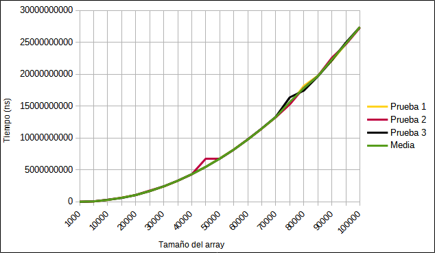</div>

Si quieres comprobar los resultados del algoritmo en mi máquina puedes encontrarlo en el siguiente [pdf](src/main/kotlin/Metodos/Ordenacion/Output/burbujaResultados.pdf). La gráfica de la tabla la encontraras en esta [hoja de calculo](src/main/kotlin/Metodos/Ordenacion/Output/Algoritmo_de_ordenación.ods)

## Método selección

El algoritmo de [selección](https://es.wikipedia.org/wiki/Ordenamiento_por_selecci%C3%B3n). su eficiencia es de O(n²).  Consiste en ir buscando el elemento más pequeño del array y colocarlo en la primera posición, luego el segundo más pequeño y colocarlo en la segunda posición, y así sucesivamente. Este método es más eficiente que el método de la burbuja, ya que solo hace una comparación por cada iteración. En definitiva, en cada iteración, se selecciona el menor elemento del subvector no ordenado y se intercambia con el primer elemento de este subvector.

- <https://www.youtube.com/watch?v=Ns4TPTC8whw>

<div align="center"></div>

### Algoritmo del metodo de ordenación selección

````Kotlin
fun seleccion(array: IntArray) {
  var aux: Int
  var min: Int
  for (i in 0 until array.size) {
    min = i
    for (j in i + 1 until array.size) {
      if (array[j] < array[min]) {
        min = j
      }
    }
    aux = array[i]
    array[i] = array[min]
    array[min] = aux
  }
}
````

### Eficiencia del método selección

El método de **selección** al igual que el burbuja cuanto más tenga que ordenar el tiempo se incrementa de forma exponencial aunque de forma mucho más eficiente. Es más rápido que el metodo burbuja pero sigue siendo inviable con arrays de gran tamaño

El algoritmo de la siguiente gráfica lo podrás encontrar en este [archivo](src/main/kotlin/Metodos/Ordenacion/2_Selección.kt) los datos dependen de la máquina que los procese por lo que tus datos serán distintos a los míos pero la forma de la gráfica sera muy similar.

<div align="center">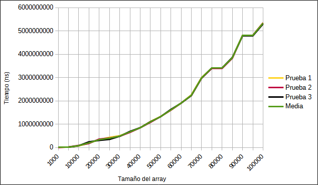</div>

Si quieres comprobar los resultados del algoritmo en mi máquina puedes encontrarlo en el siguiente [pdf](src/main/kotlin/Metodos/Ordenacion/Output/selecciónResultados.pdf). La gráfica de la tabla la encontraras en esta [hoja de calculo](src/main/kotlin/Metodos/Ordenacion/Output/Algoritmo_de_ordenación.ods)

## Método inserción

El algoritmo de [inserción](https://es.wikipedia.org/wiki/Ordenamiento_por_inserci%C3%B3n). Su eficiencia es O(n²). Es decir, el tiempo de ejecución es proporcional al cuadrado del tamaño del array. Inicialmente se tiene un solo elemento, que obviamente es un conjunto ordenado. Después, cuando hay k elementos ordenados de menor a mayor, se toma el elemento k+1 y se compara con todos los elementos ya ordenados, deteniéndose cuando se encuentra un elemento menor (todos los elementos mayores han sido desplazados una posición a la derecha) o cuando ya no se encuentran elementos (todos los elementos fueron desplazados y este es el más pequeño). En este punto se inserta el elemento k+1 debiendo desplazarse los demás elementos. En definitiva, nn cada iteración, se selecciona el menor elemento del subvector no ordenado y se intercambia con el primer elemento de este subvector.

- <https://www.youtube.com/watch?v=ROalU379l3U>

<div align="center"></div>

### Algoritmo del metodo de ordenación inserción

````Kotlin
fun insercion(array: IntArray) {
  var aux: Int
  var j: Int
  for (i in 1 until array.size) {
    aux = array[i]
    j = i - 1
    while (j >= 0 && array[j] > aux) {
      array[j + 1] = array[j]
      j--
    }
    array[j + 1] = aux
  }
}
````

### Eficiencia del método inserción

El método de **inserción** al igual que el burbuja y el de selección cuanto más tenga que ordenar el tiempo se incrementa de forma exponencial aunque de forma un poco más eficiente que el metodo de selección. Es un poco más rápido que el metodo selección pero sigue siendo inviable con arrays de gran tamaño

El algoritmo de la siguiente gráfica lo podrás encontrar en este [archivo](src/main/kotlin/Metodos/Ordenacion/3_Inserción.kt) los datos dependen de la máquina que los procese por lo que tus datos serán distintos a los míos pero la forma de la gráfica sera muy similar.

<div align="center">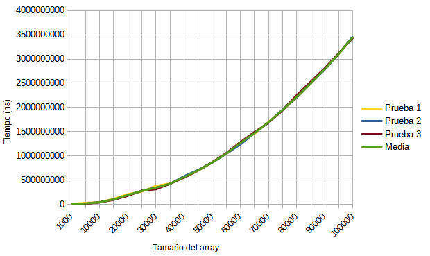</div>

Si quieres comprobar los resultados del algoritmo en mi máquina puedes encontrarlo en el siguiente [pdf](src/main/kotlin/Metodos/Ordenacion/Output/inserciónResultados.pdf). La gráfica de la tabla la encontraras en esta [hoja de calculo](src/main/kotlin/Metodos/Ordenacion/Output/Algoritmo_de_ordenación.ods)

## Método shell

El algoritmo de [Shell](https://es.wikipedia.org/wiki/Ordenamiento_Shell) es una mejora del algoritmo de inserción. Su eficiencia es de O(n log n). Este método consiste en ordenar los elementos de un array de forma que los elementos que están lejos entre sí se ordenan primero.
En lugar de comparar elementos adyacentes, se comparan elementos que están separados por un intervalo. Este intervalo se va reduciendo hasta que llega a 1. Este método es más eficiente que el método de inserción, ya que en cada iteración, se comparan elementos que están separados por un intervalo. En definitiva, en cada iteración, se selecciona el menor elemento del subvector no ordenado y se intercambia con el primer elemento de este subvector.

- <https://www.youtube.com/watch?v=yn0EgXHb5jc>

<div align="center"></div>

### Algoritmo del metodo de ordenación shellSort

````kotlin
fun shell(array: IntArray) {
  var aux: Int
  var j: Int
  var intervalo = 1
  while (intervalo < array.size) {
    intervalo = intervalo * 3 + 1
  }
  while (intervalo > 0) {
    for (i in intervalo until array.size) {
      aux = array[i]
      j = i
      while (j > intervalo - 1 && array[j - intervalo] >= aux) {
        array[j] = array[j - intervalo]
        j -= intervalo
      }
      array[j] = aux
    }
    intervalo = (intervalo - 1) / 3
  }
}
````

### Eficiencia del método shellSort

El método de **shellSort** es mucho más eficiente que los anteriores métodos y no escala de manera tan abrupta como el burbuja pero si sus valores son más dispares entre pruebas. Es muy eficiente a la hora de ordenar cuando el tamaño del array es grande.

El algoritmo de la siguiente gráfica lo podrás encontrar en este [archivo](src/main/kotlin/Metodos/Ordenacion/4_Shell.kt) los datos dependen de la máquina que los procese por lo que tus datos serán distintos a los míos pero la forma de la gráfica sera muy similar.

<div align="center">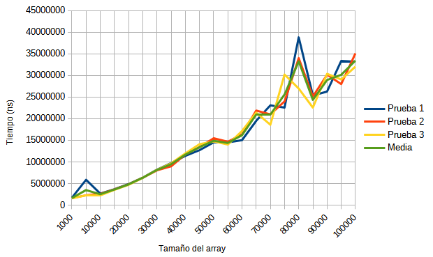</div>

Si quieres comprobar los resultados del algoritmo en mi máquina puedes encontrarlo en el siguiente [pdf](src/main/kotlin/Metodos/Ordenacion/Output/shellSortResultados.pdf). La gráfica de la tabla la encontraras en esta [hoja de calculo](src/main/kotlin/Metodos/Ordenacion/Output/Algoritmo_de_ordenación.ods)

## Método quicksort

El algoritmo de [quicksort](https://es.wikipedia.org/wiki/Quicksort) es el algoritmo más rápido que veremos. Su eficiencia es de O(n log n). Consiste en dividir el array en dos partes, una con los elementos menores que el pivote y otra con los elementos mayores que el pivote. Luego se ordenan las dos partes de forma recursiva.
Trabaja de la siguiente manera:

1. Se toma un elemento arbitrario del vector, al que denominaremos pivote (p).
2. Se divide el vector de tal forma que todos los elementos a la izquierda del pivote sean menores que él, mientras que los que quedan a la derecha son mayores que él.
3. Ordenamos, por separado, las dos zonas delimitadas por el pivote.
4. Es recursivo, de ahí su gran ventaja. Repetimos el proceso recursivamente conc ad aparte, hasta que al salir todas las llamadas tenemos el vector completo.

- <https://www.youtube.com/watch?v=ywWBy6J5gz8>

<div align="center"></div>

<div align="center">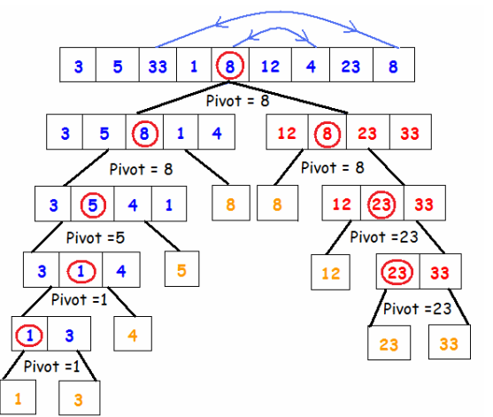</div>

### Algoritmo del metodo de ordenación quicksort

````Kotlin
fun pivote(array: IntArray, izq: Int, der: Int): Int {
  var i = izq
  var j = der
  var pivote = array[izq]
  while (i < j) {
    while (array[i] <= pivote && i < j) {
      i++
    }
    while (array[j] > pivote) {
      j--
    }
    if (i < j) {
      val aux = array[i]
      array[i] = array[j]
      array[j] = aux
    }
  }
  array[izq] = array[j]
  array[j] = pivote
  return j
}

fun quicksort(array: IntArray, izq: Int, der: Int) {
  var piv: Int
  if (izq < der) {
    piv = pivote(array, izq, der)
    quicksort(array, izq, piv - 1)
    quicksort(array, piv + 1, der)
  }
}
````

### Eficiencia del método quickSort

El método de **shellSort** es mucho más eficiente que los anteriores métodos y no escala de manera tan abrupta como el burbuja pero si sus valores son más dispares entre pruebas. Es muy eficiente a la hora de ordenar cuando el tamaño del array es grande.

El algoritmo de la siguiente gráfica lo podrás encontrar en este [archivo](src/main/kotlin/Metodos/Ordenacion/5_Quick.kt) los datos dependen de la máquina que los procese por lo que tus datos serán distintos a los míos pero la forma de la gráfica sera muy similar.

<div align="center">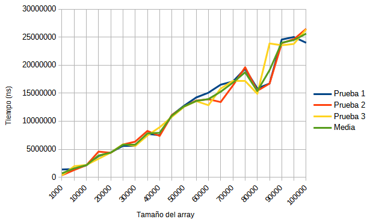</div>

Si quieres comprobar los resultados del algoritmo en mi máquina puedes encontrarlo en el siguiente [pdf](src/main/kotlin/Metodos/Ordenacion/Output/quickSortResultados.pdf). La gráfica de la tabla la encontraras en esta [hoja de calculo](src/main/kotlin/Metodos/Ordenacion/Output/Algoritmo_de_ordenación.ods)

## Comparación de la eficiencia del los métodos de ordenación

El ranking de los algoritmos de búsqueda es el siguiente:

1º QuickSort

2º ShellSort

3º Inserción

4º Selección

5º Burbuja

<div align="center">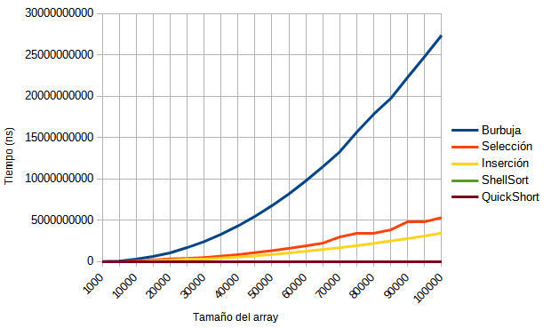</div>

<div align="center">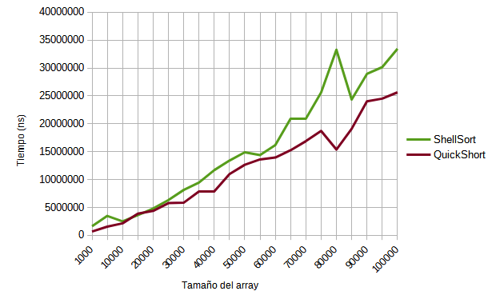</div>

Se puede ver claramente la diferencias entre los algoritmos aunque el quickSortResultados y el shellSort tienen valores muy cercanos la diferencia entre los distintos algoritmos es considerablemente grande cuanto más datos tenemos que ordenar

# Métodos de búsqueda

Los métodos de búsqueda nos servirán para encontrar un elemento en un array.

Puedes visualizarlos [aquí](https://www.cs.usfca.edu/~galles/visualization/Algorithms.html)

## Método secuencial o lineal

La búsqueda [secuencial o lineal](https://es.wikipedia.org/wiki/B%C3%BAsqueda_lineal) consiste en recorrer el vector hasta devolver el elemento buscado. Su eficiencia es de O(n). Es el método más sencillo de búsqueda, pero no es el más eficiente.

- <https://www.youtube.com/watch?v=-PuqKbu9K3U>

<div align="center">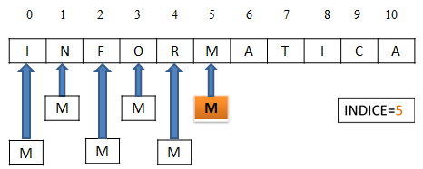</div>

### Algoritmo del metodo de búsqueda secuencial

````Kotlin
fun busquedaSecuencial(array: IntArray, elemento: Int): Int {
  for (i in array.indices) {
    if (array[i] == elemento) {
      return i
    }
  }
  return -1
}
````

### Eficiencia del metodo secuencial o lineal

El método **secuencial o lineal** con tamaño pequeño es menos eficiente con un tamaño mayor. El tiempo que tarda en buscar el el carácter con el mismo tamaño no tiene valores similares entre las pruebas como sucedía con los de ordenación.

El algoritmo de la siguiente gráfica lo podrás encontrar en este [archivo](src/main/kotlin/Metodos/Busqueda/1_Lineal.kt) los datos dependen de la máquina que los procese por lo que tus datos serán distintos a los míos pero la forma de la gráfica sera muy similar.

<div align="center">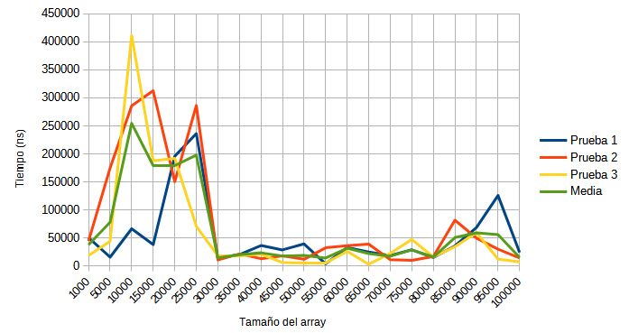</div>

Si quieres comprobar los resultados del algoritmo en mi máquina puedes encontrarlo en el siguiente [pdf](src/main/kotlin/Metodos/Ordenacion/Output/quickSortResultados.pdf). La gráfica de la tabla la encontraras en esta [hoja de calculo](src/main/kotlin/Metodos/Ordenacion/Output/Algoritmo_de_ordenación.ods)

## Método Binario

En la [búsqueda binaria](https://es.wikipedia.org/wiki/B%C3%BAsqueda_binaria) partimos de un array ordenado. Su eficiencia es de O(n log n).
Se compara el dato buscado con el elemento en el centro del vector:

1. Si coinciden, hemos encontrado el dato buscado.
2. Si el dato es mayor que el elemento central del vector, tenemos que buscar el dato en segunda mitad del vector (mejor recursivamente).
3. Si el dato es menor que el elemento central del vector, tenemos que buscar el dato en la primera mitad del vector (mejor recursivamente).

- <https://www.youtube.com/watch?v=iP897Z5Nerk>

<div align="center">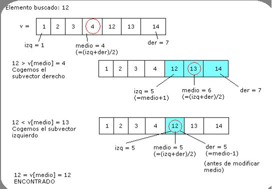</div>

### Algoritmo del metodo de búsqueda binaria

````Kotlin
// Versión Iterativa
fun busquedaBinariaIterativa(array: IntArray, elemento: Int): Int {
  var centro: Int
  var inf = 0
  var sup = array.size - 1
  while (inf <= sup) {
    centro = (sup + inf) / 2
    if (array[centro] == elemento) {
      return centro
    } else if (elemento < array[centro]) {
      sup = centro - 1
    } else {
      inf = centro + 1
    }
  }
  return -1
}

// Versión recursiva
fun busquedaBinariaRecursiva(array: IntArray, elemento: Int, inf: Int, sup: Int): Int {
  if (inf > sup) {
    return -1
  }
  val centro = (sup + inf) / 2
  return if (array[centro] == elemento) {
    centro
  } else if (elemento < array[centro]) {
    busquedaBinariaRecursiva(array, elemento, inf, centro - 1)
  } else {
    busquedaBinariaRecursiva(array, elemento, centro + 1, sup)
  }
}
````

### Eficiencia del método busqueda binaria

El metodo de **busqueda binaria iterativa y recursiva** tardan lo mismo o muy parecido a el metodo lineal y entre ellos aun que con un tamaño pequeño en el array ha tardado en la primera prueba más que el metodo lineal los datos son similares.

#### Versión iterativa

El algoritmo de la siguiente gráfica lo podrás encontrar en este [archivo](src/main/kotlin/Metodos/Busqueda/2_Binaria-Iterativa.kt) los datos dependen de la máquina que los procese por lo que tus datos serán distintos a los míos pero la forma de la gráfica sera muy similar.

<div align="center">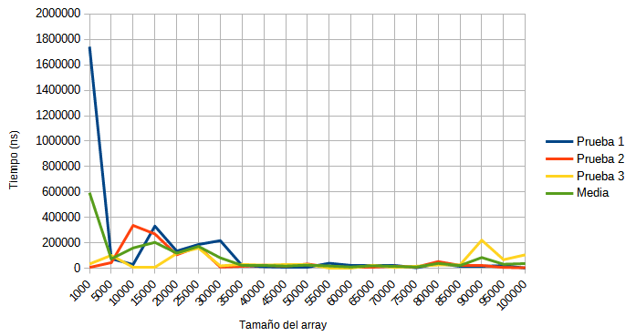</div>

Si quieres comprobar los resultados del algoritmo en mi máquina puedes encontrarlo en el siguiente [pdf](/src/main/kotlin/Metodos/Busqueda/Output/binariaIterativaResultados.pdf). La gráfica de la tabla la encontraras en esta [hoja de calculo](src/main/kotlin/Metodos/Ordenacion/Output/Algoritmo_de_ordenación.ods)

#### Versión recursiva

El algoritmo de la siguiente gráfica lo podrás encontrar en este [archivo](src/main/kotlin/Metodos/Busqueda/2_Binaria-Recursiva.kt) los datos dependen de la máquina que los procese por lo que tus datos serán distintos a los míos pero la forma de la gráfica sera muy similar.

<div align="center">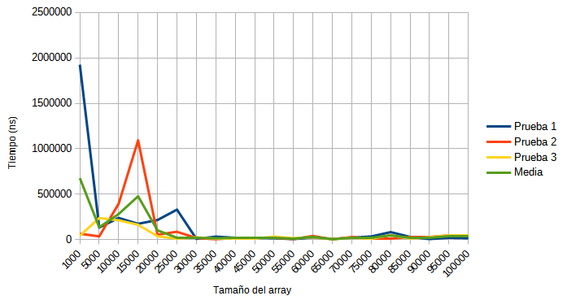</div>

Si quieres comprobar los resultados del algoritmo en mi máquina puedes encontrarlo en el siguiente [pdf](src/main/kotlin/Metodos/Busqueda/Output/binariaRecursivaResultados.pdf). La gráfica de la tabla la encontraras en esta [hoja de calculo](src/main/kotlin/Metodos/Ordenacion/Output/Algoritmo_de_ordenación.ods)

## Comparación de la eficiencia del los métodos de búsqueda

<div align="center"></div>

Al calcular la media para saber que metodo de busqueda es más eficiente veremos que es el lineal con 66.469,65 ns seguido del binario iterativo con 88.361,35 ns y por último el metodo binario recursivo con 100.194,65. Esto es así porque el metodo binario con arrays pequeños tiene más picos puntuales que suben la media pero a partir del tamaño de 35000 ya todos tienen una media muy similar entre si.
